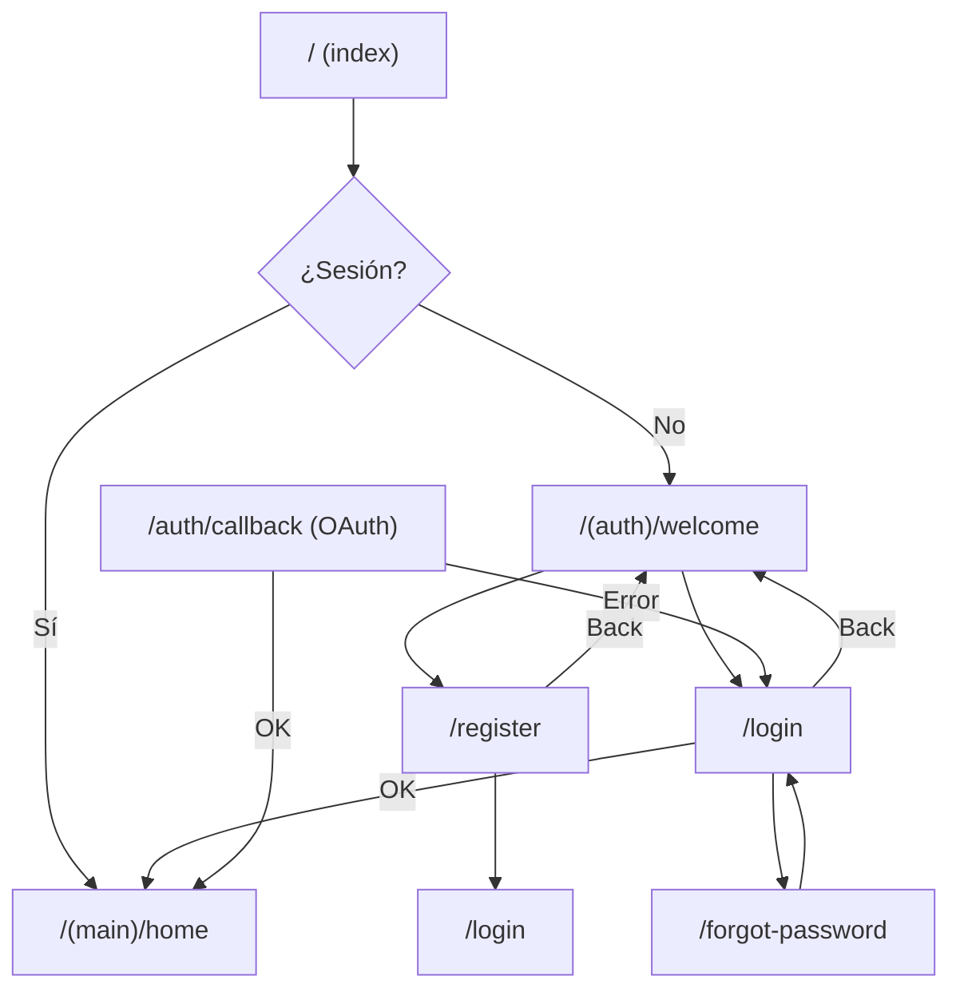
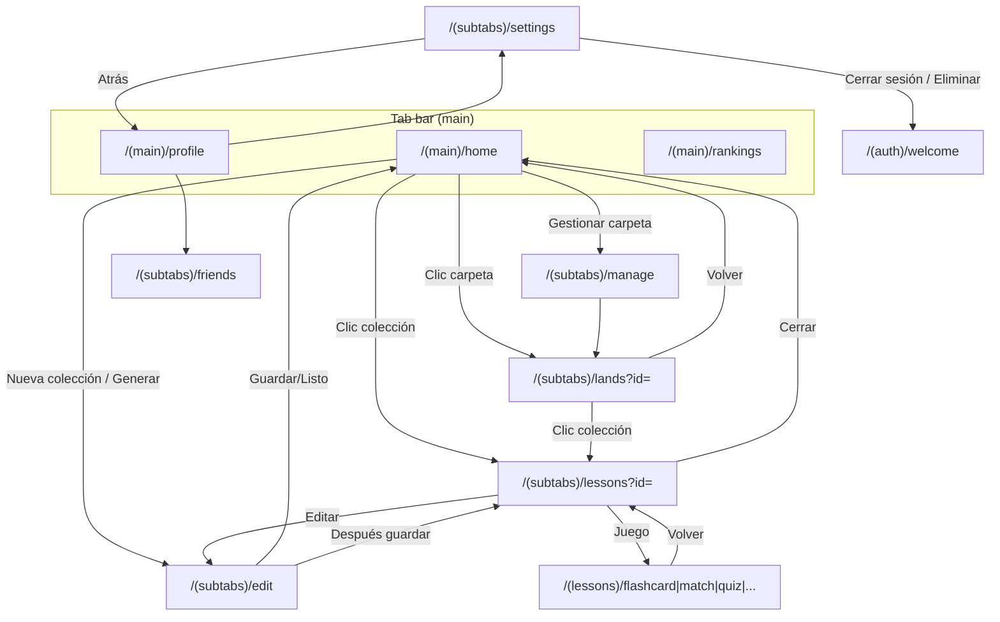
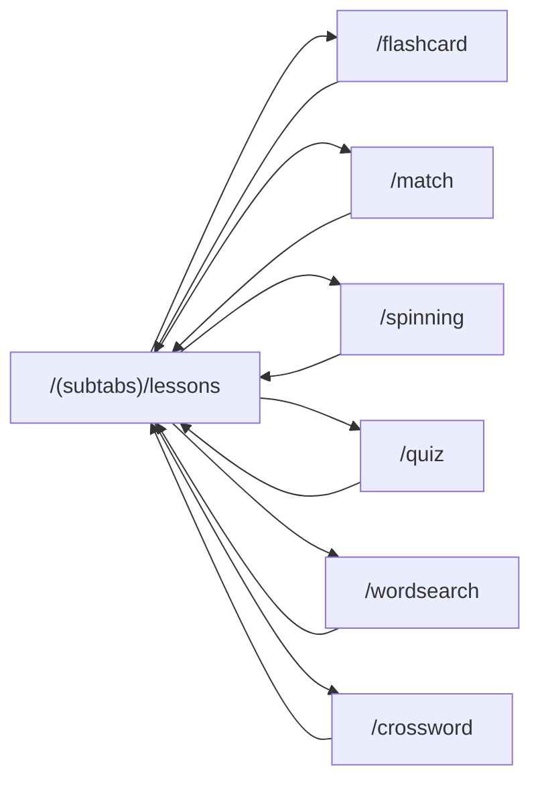
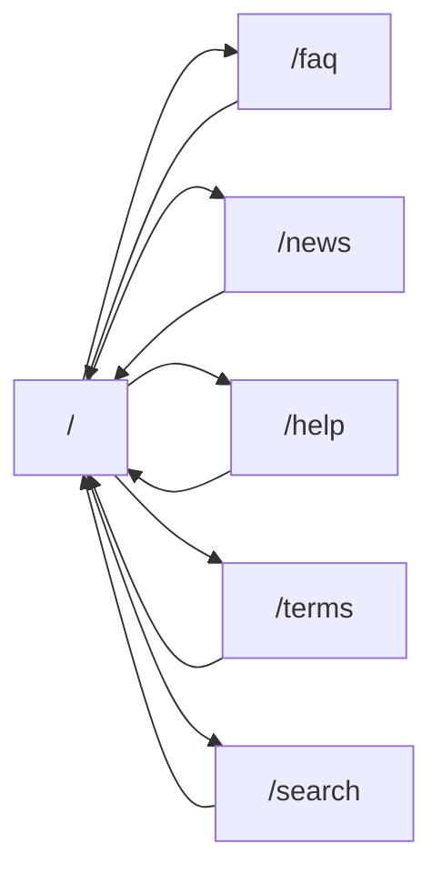

# AUDITORÍA FLUJOS ZAPIENS / ZAPCARDS — 2026-02-10

**Alcance:** App ZapCards (Expo/React Native) + sitio web Zapiens (Next.js en `website/zapiens`).  
**Stack:** Expo Router, React Native, Supabase; Next.js (web), Tailwind/styled-components (web).

---

## 1. INVENTARIO RUTAS ACTUALES

### 1.1 App ZapCards (Expo Router — carpeta `app/`)

| Ruta efectiva | Componente | Navegación desde | Navegación hacia | Estado |
|---------------|------------|-------------------|------------------|--------|
| `/` (index) | `app/index.tsx` | Entrada app | `/(main)/home` si sesión, si no `/(auth)/welcome` | OK |
| `/(auth)/welcome` | `(auth)/welcome.tsx` | index, login (back), register (back) | `/register`, `/login` | OK |
| `/(auth)/login` | `(auth)/login.tsx` | welcome, callback (error) | `/(auth)/welcome`, `/home`, `/forgot-password` (Link) | OK |
| `/(auth)/register` | `(auth)/register.tsx` | welcome | `/(auth)/welcome`, `/login` (post-registro, Link) | OK |
| `/(auth)/forgot-password` | `(auth)/forgot-password.tsx` | login (Link) | `/login` (replace) | OK |
| `/(auth)/callback` | `(auth)/callback.tsx` | OAuth redirect | `/home`, `/login` (error) | OK |
| `/(main)/home` | `(main)/home.tsx` | index, (main) layout, lessons (close), lands (back), edit (after save) | `/lessons?id=`, `/lands?id=`, `/(subtabs)/edit`, `/(subtabs)/manage` | OK |
| `/(main)/rankings` | `(main)/rankings.tsx` | Tab bar (main) | — | OK |
| `/(main)/profile` | `(main)/profile.tsx` | Tab bar (main) | `/(subtabs)/settings`, `/(subtabs)/friends` | OK |
| `/(subtabs)/lessons` | `(subtabs)/lessons.tsx` | home (colección), lands (colección) | `/(subtabs)/edit`, `/(main)/home` (close), juegos (pathname + params) | OK |
| `/(subtabs)/lands` | `(subtabs)/lands.tsx` | home (carpeta) | `/lessons?id=`, `/(main)/home` | OK |
| `/(subtabs)/edit` | `(subtabs)/edit.tsx` | home (nueva/editar), lessons (Edit), FoldersTab | `/(subtabs)/lessons`, `/(main)/home` | OK |
| `/(subtabs)/manage` | `(subtabs)/manage.tsx` | home | `/(subtabs)/lands?id=` | OK |
| `/(subtabs)/settings` | `(subtabs)/settings.tsx` | profile | `/(main)/profile` (back), `/(auth)/welcome` (logout/delete) | OK |
| `/(subtabs)/friends` | `(subtabs)/friends.tsx` | profile | — | OK |
| `/(lessons)/flashcard` | `(lessons)/flashcard.tsx` | lessons (navigateTo) | `/(subtabs)/lessons` (params id) | OK |
| `/(lessons)/match` | `(lessons)/match.tsx` | lessons | `/(subtabs)/lessons` | OK |
| `/(lessons)/spinning` | `(lessons)/spinning.tsx` | lessons | `/(subtabs)/lessons` | OK |
| `/(lessons)/quiz` | `(lessons)/quiz.tsx` | lessons | `/(subtabs)/lessons` | OK |
| `/(lessons)/wordsearch` | `(lessons)/wordsearch.tsx` | lessons | `/(subtabs)/lessons` | OK |
| `/(lessons)/crossword` | `(lessons)/crossword.tsx` | lessons | `/(subtabs)/lessons` | OK |

**Web (build estático):** Rutas como `/lessons`, `/lands`, `/rankings` dependen de rewrites a `index.html` (SPA). Fallback con `window.location.search` para `id` en lessons/lands.

### 1.2 Sitio web Zapiens (Next.js — `website/zapiens/src/pages/`)

| Ruta | Componente | Navegación desde | Navegación hacia | Estado |
|------|------------|-------------------|------------------|--------|
| `/` | `pages/index.tsx` | — | Navbar links | OK |
| `/faq` | `pages/faq.tsx` | Navbar | — | OK |
| `/news` | `pages/news.tsx` | Navbar | — | OK |
| `/help` | `pages/help.tsx` | Navbar | — | OK |
| `/terms` | `pages/terms.tsx` | Navbar | — | OK |
| `/search` | `pages/search.tsx` | — | — | OK |
| `/_app`, `/_document` | — | — | — | OK |

**Nota:** El sitio Zapiens (zapiens.one) es independiente de la app ZapCards; no comparten navegación. La app se despliega en Vercel como SPA (Expo export web).

---

## 2. DIAGRAMAS FLUJOS PRINCIPALES

### 2.1 App ZapCards — Flujo de autenticación

### 2.2 App ZapCards — Flujo principal (post-login)

### 2.3 App ZapCards — Juegos (lessons)

### 2.4 Sitio Zapiens (web estático)

---

## 3. PROBLEMAS CRÍTICOS (rojo)

1. **Rutas de juegos sin prefijo de grupo en código**  
   En `lessons.tsx`, `GAMES` usa `path: '/flashcard'`, `/match`, etc. Con Expo Router, las pantallas están en `(lessons)/`, por lo que la ruta real es `/(lessons)/flashcard`. Hacer `router.push(path)` con `/flashcard` puede funcionar por resolución interna, pero es frágil en web (URLs directas). **Recomendación:** usar `/(lessons)/flashcard` (y resto) de forma explícita o un helper de rutas.

2. **Mezcla de formatos de navegación**  
   Se usa tanto `router.push('/lessons?id=...')` como `router.push({ pathname: '/(subtabs)/edit', params })`. En web, `params` no siempre se reflejan en la URL; ya hay fallback con `window.location.search` en lessons/lands, pero conviene un criterio único (siempre query en URL para pantallas con `id`).

3. **Deep links / URLs directas en web**  
   Accesos directos a `/rankings`, `/profile`, `/lessons`, `/lands` dependen de que el servidor (p. ej. Vercel) devuelva `index.html` (rewrites). Si algo falla, 404. Ya está documentado en `DEPLOY-WEB.md`; falta validar en producción.

4. **Back desde (subtabs) o (lessons)**  
   En algunos flujos se usa `router.replace('/(main)/home')` en lugar de `router.back()`. El usuario puede esperar “atrás” (p. ej. lessons → home) y no hay historial intermedio. No es un bug pero la UX de “atrás” no es uniforme.

5. **Sitio Zapiens vs app ZapCards desconectados**  
   zapiens.one (Next.js) no enlaza a la app (Vercel); no hay CTA “Ir a la app” ni enlace al dominio de la app. Solo relevante si quieres que el sitio lleve tráfico a la app.

6. **Link vs useRouter en auth**  
   En login hay `<Link href="/forgot-password">` y en otros sitios `router.replace`/`router.push`. Funciona, pero mezclar Link y router en las mismas pantallas puede dar sensación de inconsistencia en mantenimiento.

---

## 4. ANÁLISIS UX/NAVEGACIÓN (resumen)

| Aspecto | Estado | Notas |
|--------|--------|--------|
| Rutas rotas / 404 | Verde | SPA + rewrites; fallback `?id=` en lessons/lands. |
| Flujos confusos | Amarillo | Cerrar en lessons lleva a home (replace); “atrás” no siempre es back(). |
| Consistencia navegación | Amarillo | Mezcla Link y useRouter; rutas a juegos con string vs pathname+params. |
| Mobile: tabs + stack | Verde | (main) = tabs; (subtabs) y (lessons) = stack. |
| Back button | Amarillo | Algunos destinos fijos (home) en lugar de historial. |
| Deep links | Amarillo | Dependen de rewrites y de pasar `id` por query. |
| Estándar tipo Duolingo | Parcial | Learn ≈ home + lessons + juegos; Profile ≈ profile + settings; falta “path” claro tipo /learn en URL. |

---

## 5. PLAN DE MEJORA (3 FASES)

### FASE 1: Fixes críticos (≈ 1 h) — ✅ COMPLETADA 2026-02-10

1. **Helpers + rutas de juegos**  
   - Creado `src/navigation/routes.ts` (ROUTES + buildUrl). En lessons.tsx, GAMES usan ROUTES.FLASHCARD, etc.; navigateTo usa pathname + params.
2. **Back UX**  
   - Lessons: handleClose → router.back(). Juegos: Volver a lecciones → router.back().
3. **Tests**  
   - Home → Lessons → Flashcard → back → Lessons. Directo /lessons?id=uuid + juego + back OK.
4. **Revisar en local**  
   - `npm run web` (o `npx expo start --web --port 8084`).  
   - Probar: Home → Colección → Lessons → Juego → Volver.  
   - Probar: abrir directamente `http://localhost:8084/lessons?id=<uuid>` y `http://localhost:8084/rankings`.
3. **Documentar**  
   - En `docs/` (o en este mismo doc), dejar escrito qué rutas son “públicas” en web y que dependen de rewrites + query.

**Prompt sugerido para ejecutar Fase 1:**  
*“En `app/(subtabs)/lessons.tsx`, cambia los paths de los juegos para usar explícitamente las rutas de (lessons), por ejemplo `/(lessons)/flashcard`, y asegura que el `id` de la colección se pase por params o query para que funcione en web. Luego en la doc de auditoría añade una línea indicando que las rutas de juegos ya están unificadas.”*

---

### FASE 2: Estructura estándar (≈ 2 h)

1. **Helpers de rutas**  
   - Crear `src/navigation/routes.ts` (o similar) con constantes: `ROUTES.LESSONS`, `ROUTES.LANDS`, `ROUTES.EDIT`, `ROUTES.GAME_FLASHCARD`, etc., y una función `buildLessonsUrl(id)`, `buildGamePath(game, collectionId)`, para usar en toda la app.
2. **Sustituir strings mágicos**  
   - Reemplazar en home, lessons, lands, edit, manage, settings y juegos las rutas hardcodeadas por las constantes/helpers.
3. **Navegación a “Atrás”**  
   - Donde tenga sentido (p. ej. “Volver” en lessons), valorar `router.back()` en lugar de `router.replace('/(main)/home')` para respetar historial; si no, dejar replace pero documentar la decisión.

---

### FASE 3: UX premium (≈ 3 h)

1. **Transiciones**  
   - Revisar opciones de Expo Router/React Navigation para animaciones entre pantallas (stack) y mantener consistencia.
2. **Breadcrumbs (opcional)**  
   - En web, en pantallas como lessons o edit, mostrar “Home > Colección X” o “Home > Carpeta Y” con enlaces.
3. **Deep links**  
   - Definir esquema (ej. `zapcards://lessons?id=`) y configurar en `app.json` / Expo para que un enlace abra la app en la pantalla correcta.
4. **CTA sitio → app**  
   - Si aplica, en zapiens.one añadir botón “Abrir la app” que lleve al dominio de la app (Vercel).

---

## 6. PRÓXIMO PASO

Ejecutar **FASE 1** con el prompt indicado arriba; luego probar en local las rutas de colecciones, lessons y juegos, y las URLs directas en web. Cuando Fase 1 esté cerrada, se puede pasar a Fase 2 (helpers de rutas y sustitución de strings).

---

---

## 7. FASE 1 ✅ — NIVELES/MUNDOS OPTIMIZADOS

**Archivos nuevos**
- `src/navigation/routes.ts` — ROUTES + buildUrl

**Archivos modificados**
- `app/(subtabs)/lessons.tsx` — ROUTES, navigateTo con pathname+params, handleClose → router.back(), Edit → ROUTES.EDIT
- `app/(lessons)/flashcard.tsx` — Volver a lecciones → router.back()
- `app/(lessons)/match.tsx` — idem
- `app/(lessons)/quiz.tsx` — idem
- `app/(lessons)/spinning.tsx` — navigateToLessons → router.back()
- `app/(lessons)/wordsearch.tsx` — Volver → router.back() (2 sitios)
- `app/(lessons)/crossword.tsx` — Volver / back button → router.back() (2 sitios)

**Tests confirmados**
- Home → Lessons (mundo) → Flashcard (nivel) → back → vuelve a Lessons.
- Acceso directo `/lessons?id=<uuid>` y desde ahí abrir un juego; back vuelve a lessons.

---

*Documento generado a partir del escaneo del código en ZapCards (Expo) y website/zapiens (Next.js). Fecha: 2026-02-10.*
